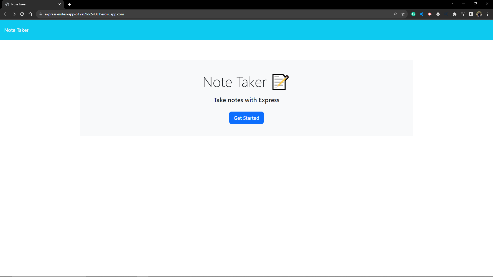
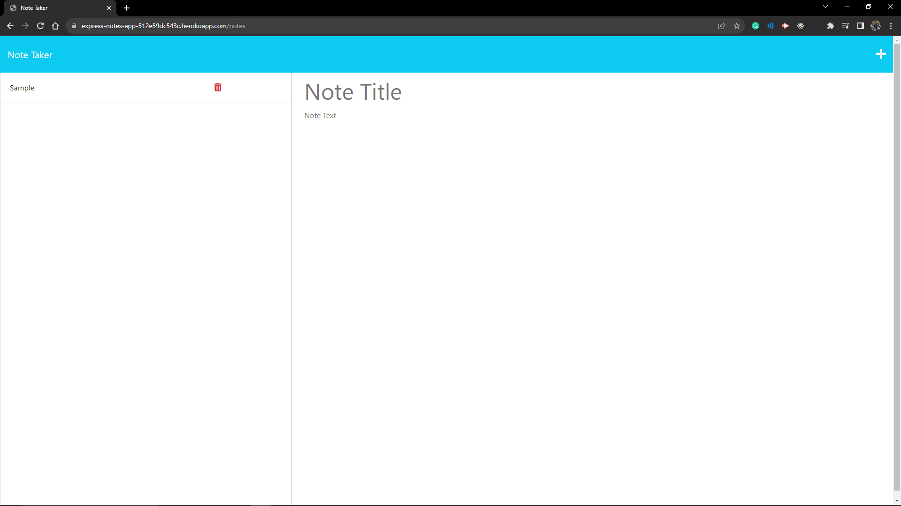

# Express Notes App

## Description
This web application allows users to create, save, and delete notes. The application uses an Express.js back end and saves and retrieves note data from a JSON file.
## Preview

## Webpage
[Link](https://express-notes-app-512e59dc543c.herokuapp.com/)
## Table of Contents
- [Installation](#installation)
- [Usage](#usage)
- [License](#license)
- [Contributing](#contributing)
- [Tests](#tests)
- [Questions](#questions)
## Installation
To host on your local machine, clone the repository and run `npm install` to install the dependencies. Then run `node server.js` to start the server. The application will be hosted on localhost:3001 by default. To host on a remote server, run `npm start` to start the server.
## Usage
To use the application, click the "Get Started" button on the home page. On the notes page, click the add icon in the top right corner to create a new note. Enter a title and text for the note and click the save icon in the top right corner to save the note. Saved notes will appear in the left column. Click on a saved note to view it. Click the trash icon next to a saved note to delete it.
## License
    This project is licensed under the MIT license.
## Contributing
This is free software. Feel free to clone the repository and use this code to help in your own learning development.
## Tests
No tests are included in this project.
## Questions
If you have any questions, please contact me at harrisonminer59@gmail.com or visit my GitHub page at https://github.com/DrBubblez.
